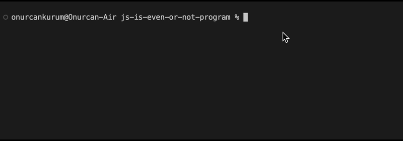

# A Program that finds out if number is a odd or even.
This program checks if number is odd or even. 
## to install and run

before you run commands make sure you have node is installed in your system

```cmd
git clone https://github.com/onurcankurum/js-is-even-or-not-program.git
node is_even_or_odd.js
```
## console video
 